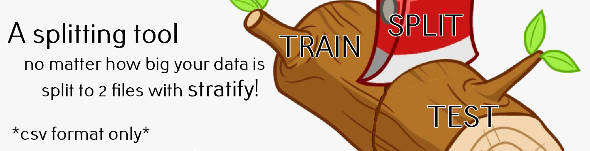
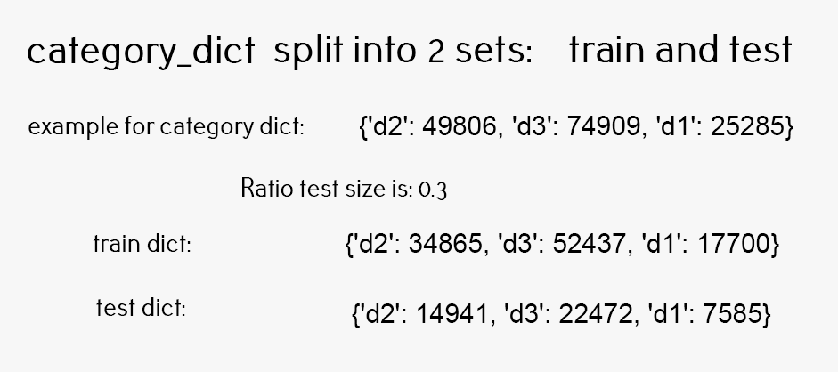

# Test Train Stratify
Split data to train and test with stratify, no matter how big is the file. (CSV format only)

### How to use
##### The steps:
##### 1. Select a column to stratify
##### 2. Choose the ratio of the test, and train sets
##### 3. Run the script with the command : python test_train_stratify.py 'your_file.csv' ratio column
##### For example: 
python test_train_stratify.py data.csv 0.3 device True
#####   ------------------------------------ file-name ratio column shuffle

### stratify_info_train_test explanation
We create category dict, counting each unique category occurrences put them inside a dict
Splitting each category by the user's input test size proportion
#### output: train dict and test dict
for example, we have category device with unique values d1, d2 and d3.

### train_test_write explanation
Getting the 2 data sets info on the category unique counts we iterate once again, this time, we will 
subtract 1 from a unique count if we meet a row with the same unique value. 
We do that until we finish the function, each time writing the row into 2 files, train and test.
#### output: train.csv and test.csv

### Dependencies 
I used Python 3.7

###imports I used:
logging  
csv   
os  
random  
tqdm  

### Credit
Made by Oriel Pinhas
